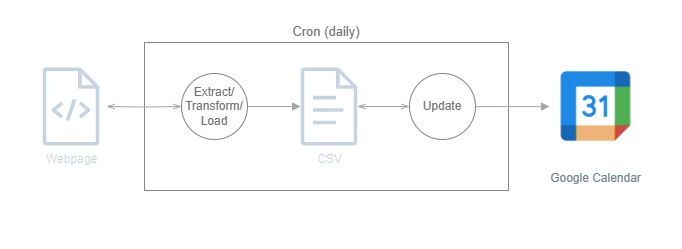

# Economic Google Calendar

A web scraper that fetches high-impact US economic events from [Trading Economics](https://tradingeconomics.com/united-states/calendar), stores them in PostgreSQL, and syncs them to a Google Calendar.

Events are filtered by importance level (1-3) and specific keywords (Initial Jobless Claims, GDP Growth Rate, Core PCE). All times are stored in UTC and displayed in Central Time.



## Project Structure

```
src/
├── api.py                        # FastAPI REST API (Lambda-deployable)
├── scraper_handler.py            # Scheduled scrape handler (Lambda-deployable)
├── config/
│   └── settings.py               # Centralized configuration
├── scrapers/
│   └── trading_economics.py      # Web scraper for Trading Economics
├── processors/
│   └── event_processor.py        # Data cleaning and transformation
├── services/
│   ├── database_service.py       # PostgreSQL operations
│   └── calendar_service.py       # Google Calendar integration
├── utils/
│   └── db_utils.py               # Database connection manager
└── tests/
    ├── conftest.py
    └── test_db_utils.py
```

## Setup

### Prerequisites

- Python 3.10+
- PostgreSQL
- Google Cloud project with Calendar API enabled

### Install

```bash
python -m venv .venv
source .venv/bin/activate
pip install -r requirements.txt
```

### Environment Variables

Create a `.env` file in the project root:

```
POSTGRES_DB=your_db
POSTGRES_USER=your_user
POSTGRES_PASSWORD=your_password
POSTGRES_HOST=127.0.0.1
POSTGRES_PORT=5432
```

### Google Calendar

Place your OAuth credentials in `resources/`:
- `resources/credentials.json` — OAuth client credentials from Google Cloud Console
- `resources/oauth-token.json` — generated automatically on first auth

## Usage

### Run the scraper

```bash
python -c "from src.scraper_handler import handler; handler({}, None)"
```

### Start the API

```bash
uvicorn src.api:app --reload
```

### API Endpoints

| Method | Endpoint | Description |
|--------|---------------------|--------------------------------------|
| GET | `/health` | Health check with DB status |
| GET | `/events` | List events (query: `days`, `level`) |
| GET | `/events/stats` | Event statistics |
| GET | `/events/unsynced` | Events not yet synced to Google Cal |
| POST | `/scrape` | Trigger a scrape and store results |
| POST | `/sync` | Sync unsynced events to Google Cal |

### Run tests

```bash
pytest src/tests/
```

## Tech Stack

- **Scraping**: BeautifulSoup4, Requests
- **Data Processing**: Pandas
- **Database**: PostgreSQL (psycopg2)
- **API**: FastAPI, Uvicorn
- **Calendar**: Google Calendar API
