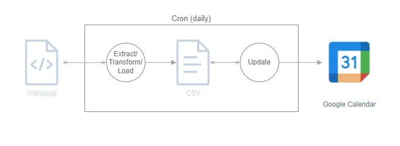

# Economic Google Calendar

A simple webscraper that fetches high-impact economic news events from tradingeconomics.com and adds them to a Google calendar. 

Recently re-written in python using pandas. BeautifuleSoup4 is used for html parsing. 

The google calendar was used for all the functionality it already comes with. This calendar can easily be added to existing Google Calendars to leverage notifications and widgets as well as feed other applications such as discord bots. 

